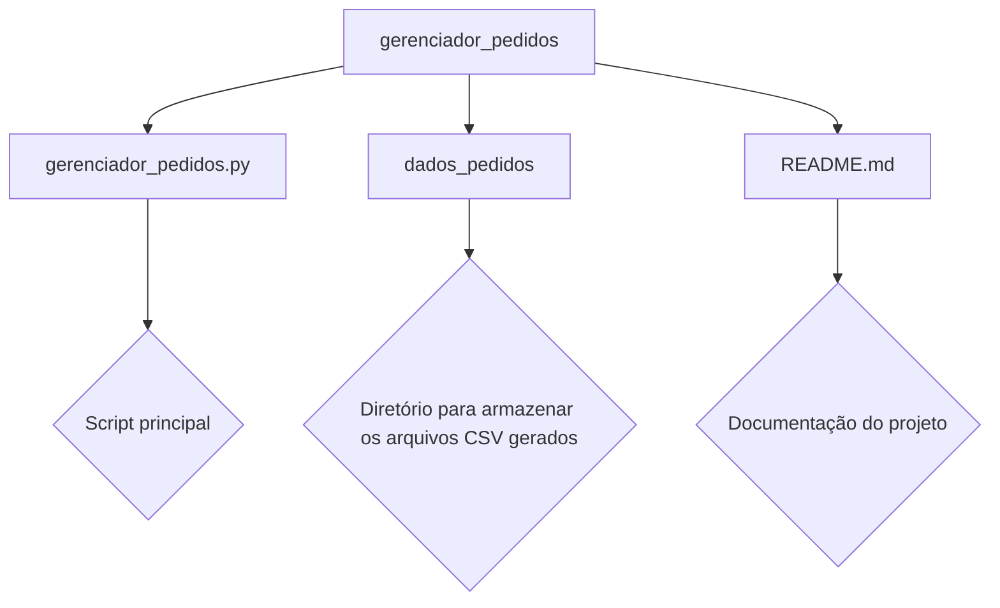

# Desafio_tecnico_Mesha_Rpa
Desafio Python (RPA) Construir um Gerenciador de Recursos

# Gerenciador de Recursos - Processamento de Pedidos
## Descrição do Projeto
Este projeto é um script em Python que automatiza o processamento de pedidos em uma loja online fictícia. O objetivo é validar, processar e registrar pedidos, além de lidar com cenários como produtos fora de estoque ou pedidos incompletos.

# Fluxo do Processo
O bot realiza as seguintes etapas no processamento de pedidos:

1 - Recebimento do Pedido
- O pedido contém:
- Nome do cliente
- Lista de produtos solicitados e respectivas quantidades

2 - Validação do Pedido 

Verifica se o pedido possui as informações obrigatórias:
- Nome do cliente
- Lista de produtos

3 - Processamento do Pedido

- Calcula o valor total do pedido.
- Verifica a disponibilidade dos produtos no estoque.
- Atualiza o estoque após a validação.

4 - Registro do Pedido

- Os pedidos processados são salvos em um arquivo pedidos_processados.csv dentro da pasta dados_pedidos.
- A data, o nome do cliente, os produtos solicitados e o valor total são registrados.

5 - Geração de Relatórios

- Ao final do processamento, um relatório consolidado é salvo em formato CSV.

# Tecnologias Utilizadas

- Python 3.8+
- Pandas: Manipulação de dados e arquivos CSV.
- Logging: Registro das atividades e status do processamento.
- OS: Manipulação de diretórios e arquivos locais.


# Pré-requisitos
Antes de executar o projeto, certifique-se de que você possui o Python e as bibliotecas necessárias instaladas.

Instalação das Dependências
Execute o comando abaixo para instalar as bibliotecas:
```bash
  pip install pandas openpyxl
```


# Instalação

1 - Clone este repositório ou copie os arquivos do projeto.

```bash
  git clone <URL_DO_REPOSITÓRIO>
cd gerenciador_pedidos
```

2 - Execute o script principal:

```bash
python gerenciador_pedidos.py
```

3 - Após a execução:

- O diretório dados_pedidos/ será criado automaticamente.
- O arquivo pedidos_processados.csv será gerado com os pedidos processados.
- Logs do processamento serão exibidos no terminal.

# Estrutura do projeto

gerenciador_pedidos/  
|  
├── gerenciador_pedidos.py        # Script principal  
├── dados_pedidos/            # Diretório para armazenar os arquivos CSV gerados  
└── README.md                 # Documentação do projeto

# Diagrama



# Autores

- [@juanluisdev](https://www.github.com/juanluisdev)


# Demonstração  
## Exemplo de Entrada e Saída  
### Entrada  
Pedidos simulados no código:
```bash
  pedidos = [
        {"nome_do_cliente": "João", "Produtos": {"Produto_1": 2, "Produto_2": 1}},
        {"nome_do_cliente": "Maria", "Produtos": {"Produto_3": 5, "Produto_1": 8}},
        {"nome_do_cliente": "Carlos", "Produtos": {"Produto_2": 50}},  # Não há estoque insuficiente
        {"nome_do_cliente": "", "Produtos": {"Produto_1": 2}},  # Pedido é inválido
    ]
```

### Saída
Arquivo pedidos_processados.csv (exemplo):
| Data | Nome do Cliente | Produtos | Total |
| :---         |     :---:      |          :---: | ---: |  |
| 2024-08-20 14:35:12   | João     | {"produto_1": 2, "produto_2": 1}    | 30 |
| 2024-08-20 14:35:12     | maria       | {"produto_3": 5, "produto_1": 8}      | 130 |

# Possíveis Melhorias  
- Integração com um banco de dados (SQLite ou PostgreSQL).
- Implementação de paralelismo para processar múltiplos pedidos simultaneamente.
- Uso de APIs para simular pedidos em tempo real.
- Geração de relatórios em formato Excel.

# Licença
Este projeto é de uso livre para fins educacionais e de aprendizado.
